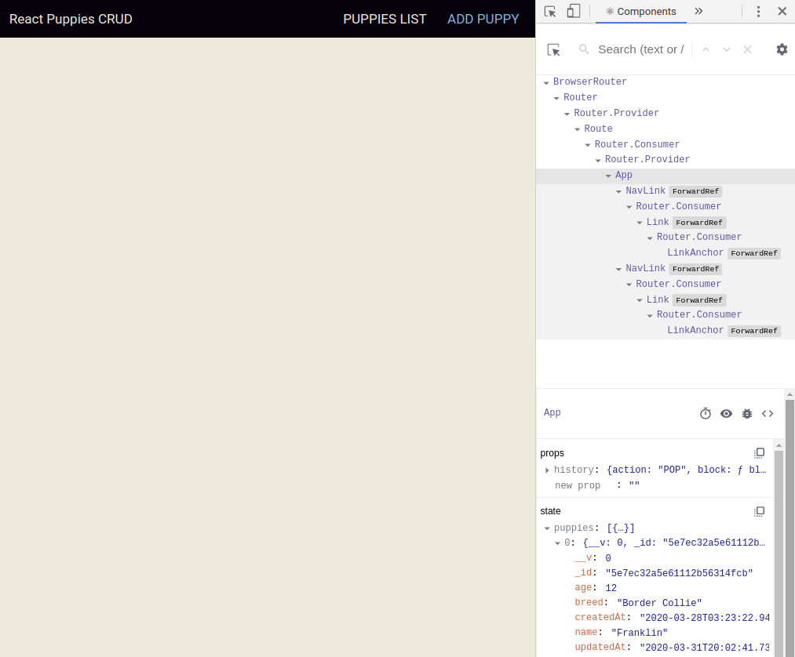

# react-puppies-crud-frontend
## This application serves as the front end for a full-stack MERN application demonstrating full CRUD with puppies.  
## The back end application can be found [here](https://github.com/ManliestBen/node-puppies-crud-backend).
## Here is a diagram of how this decoupled app will work:

## Create the React app in a different directory than your backend, then navigate inside.
```
npx create-react-app pup-app-frontend
cd pup-app-frontend
```
## Start by removing the files we won't need:
```
rm src/App.test.js src/setupTests.js
```
## Create directories for components, pages, and services.  Move App.js and App.css inside of a directory within pages named App:
```
mkdir src/components src/pages src/services
mkdir src/pages/App
mv src/App.js src/pages/App
mv src/logo.svg src/pages/App
mv src/App.css src/pages/App
```
## Install the react-router-dom package using npm.  Adjust index.js with the new path to App.js.  Add a Router to allow the app access to history and location:
```
npm i react-router-dom
```
```js
import React from 'react';
import ReactDOM from 'react-dom';
import {BrowserRouter as Router, Route} from 'react-router-dom';
import './index.css';
import App from './pages/App/App';
import * as serviceWorker from './serviceWorker';

ReactDOM.render(
  <Router>
    <React.StrictMode>
      <Route render={({history}) => <App history={history} />} />
    </React.StrictMode>
  </Router>,
  document.getElementById('root')
);
```
## Fire up the app and make sure the page loads properly:
```
npm start
```
## Add the CDN for Bootstrap in public/index.html for simple styling and adjust the title of the app:
```html
<link rel="stylesheet" href="https://maxcdn.bootstrapcdn.com/bootstrap/3.3.7/css/bootstrap.min.css" integrity="sha384-BVYiiSIFeK1dGmJRAkycuHAHRg32OmUcww7on3RYdg4Va+PmSTsz/K68vbdEjh4u" crossorigin="anonymous">
<title>React Puppies CRUD</title>
```
## Replace the current contents of index.css with some simple styling:  
```css
body {
  margin: 0;
  font-family: -apple-system, BlinkMacSystemFont, "Segoe UI", "Roboto", "Oxygen",
    "Ubuntu", "Cantarell", "Fira Sans", "Droid Sans", "Helvetica Neue",
    sans-serif;
  -webkit-font-smoothing: antialiased;
  -moz-osx-font-smoothing: grayscale;
}

code {
  font-family: source-code-pro, Menlo, Monaco, Consolas, "Courier New",
    monospace;
}

:root {
  --black: #07020D;
  --accent: #5DB7DE;
  --background: #F1E9DB;
  --secondary: #A39B8B;
  --secondary-dark: #716A5C;
}

a {
  color: var(--accent);
  padding: 1vmin;
  border-radius: 1vmin;
  text-decoration: none !important;
}

a:hover {
  color: var(--black);
  background-color: var(--accent);
}

a.active {
  color: var(--background);
  background-color: var(--black);
  cursor: default;
}

dl {
  margin-bottom: 0;
}

.margin-left-10 {
  margin-left: 10px;
}
```
## Replace the current contents of App.css with some simple styling:
```css
.App {
  min-height: 100vh;
  display: grid;
  grid-template-rows: 7vmin auto;
}

.App-header {
  background-color: var(--black);
  display: flex;
  align-items: center;
  justify-content: space-between;
  padding: 2vmin;
  font-size: 2.5vmin;
  color: var(--background);
}

.App main {
  background-color: var(--background);
  display: flex;
  flex-flow: column nowrap;
  justify-content: center;
  align-items: center;
}

.App main h1 {
  color: var(--secondary-dark);
  margin-bottom: 5vmin;
}
```
## Remove the contents of the App.js component and replace with a simple nav bar:
```js
import React, {Component} from 'react';
import './App.css';
import {Route, NavLink} from 'react-router-dom';

class App extends Component {
  state = {
    puppies: []
  };

  render() {
    return (
      <div className="App">
        <header className="App-header">
          React Puppies CRUD
          <nav>
            <NavLink exact to='/'>PUPPIES LIST</NavLink>
            &nbsp;&nbsp;&nbsp;
            <NavLink exact to='/add'>ADD PUPPY</NavLink>
          </nav>
        </header>
        <main>
          
        </main>
      </div>
    )
  }
}

export default App;
```
## Create puppies-api.js inside of the services directory.  This file will hold the functions responsible for interacting with the backend.  Import these functions in App.js to gain access to them:
```
touch src/services/puppies-api.js
```
```js
// App.js
.
.
.
import {Route, NavLink} from 'react-router-dom';
// Add the following line:
import * as puppyAPI from '../../services/puppies-api';

class App extends Component {
.
.
.
```
## To use a decoupled app, CORS needs to be installed and configured.  Install the package using npm and then configure it in the back end server.
```
(In the back end server)
npm i cors
```
```js
// server.js in the back end application
const cors = require('cors');
.
.
.
app.use(cors());
.
.
.
```
## In the back end server application, reconfigure the port to 3001.  In the front end, configure a proxy in package.json so that requests are sent to the back end properly:
```js
// server.js inside of the back end application
const port = process.env.PORT || 3001;
```
```js
// At the bottom of front-end package.json
"development": [
      "last 1 chrome version",
      "last 1 firefox version",
      "last 1 safari version"
    ]
  },
  "proxy": "http://localhost:3001"
}
```
## The controller functions in the back end also need to be re-written as asynchronous functions using async await:
```js
// puppies.js in back end server:
const Puppy =require('../../models/puppy');

module.exports = {
    index,
    create,
    show,
    update,
    delete: deleteOne

};

async function index(req, res) {
    const puppies = await Puppy.find({});
    res.status(200).json(puppies);
}

async function create(req, res) {
    const puppy = await Puppy.create(req.body);
    res.status(201).json(puppy);
}

async function show(req, res) {
    const puppy = await Puppy.findById(req.params.id);
    res.status(200).json(puppy);
}

async function update(req, res) {
    const updatedPuppy = await Puppy.findByIdAndUpdate(req.params.id, req.body, {new: true});
    res.status(200).json(updatedPuppy);
}

async function deleteOne(req, res) {
    const deletedPuppy = await Puppy.findByIdAndRemove(req.params.id);
    res.status(200).json(deletedPuppy);
}
```
## Export a function to fetch all the puppies from the back end server:
```js
// puppies-api.js
const BASE_URL = '/api/puppies';

export function getAll() {
  return fetch(BASE_URL)
  .then(res => res.json());
}
```
## Write a Lifecycle Method inside of App.js to get all the puppy data when the component is loaded and save them to state:
```js
async componentDidMount() {
    const puppies = await puppyAPI.getAll();
    this.setState({puppies});
}
```
## Use React Dev Tools to examine state and make sure your puppies are showing up.

## To display the state of the app, create an element named PuppyListPage.  Create a Route for this element so the link in the nav bar works, and pass state to it in App.js:
```
mkdir src/pages/PuppyListPage
touch src/pages/PuppyListPage/PuppyListPage.jsx
touch src/pages/PuppyListPage/PuppyListPage.css
```
```js
// App.js
.
.
.
import PuppyListPage from '../../pages/PuppyListPage/PuppyListPage';
.
.
.
<Route exact path='/' render={({history}) => 
    <PuppyListPage
        puppies={this.state.puppies}
    />
} />
.
.
.
```
## Here's some CSS to put in PuppyListPage.css:
```css
.PuppyListPage-grid {
  width: 80%;
  display: grid;
  grid-template-rows: repeat(auto-fit, minmax(170px, 1fr));
  grid-gap: 20px;
}
```
## Write the code for the PuppyListPage page.  Display each puppy's information using map:
```js
import React from 'react';
import './PuppyListPage.css';

function PuppyListPage(props) {
  return (
    <>
      <h1>Puppy List</h1>
      <div className='PuppyListPage-grid'>
        {props.puppies.map(puppy =>
            <div>
                <li>Puppy Name: {puppy.name}</li>
                <li>Breed: {puppy.breed}</li>
                <li>Age: {puppy.age}</li>
            </div>
        )}
      </div>
    </>
  );
}

export default PuppyListPage;
```
## On a page refresh, the puppies should now be showing up on the page.  Instead of displaying them in a gross-looking list, use a schnazzy Bootstrap card.  Create a component called PuppyCard to contain the card:
```
mkdir src/components/PuppyCard
touch src/components/PuppyCard/PuppyCard.jsx
```
```js
// PuppyCard.jsx
import React from 'react';

function PuppyCard({puppy}) {
    return (
        <div className='panel panel-default'>
            <div className="panel-heading">
                <h3 className='panel-title'>{puppy.name}</h3>
            </div>
            <div className='panel-body'>
                <dl>
                    <dt>Breed</dt>
                    <dd>{puppy.breed}</dd>
                    <dt>Age</dt>
                    <dd>{puppy.age}</dd>
                </dl>
            </div>
        </div>
    )
}

export default PuppyCard;
```
## Adjust the PuppyListPage to use the newly added card:
```js
// PuppyListPage.jsx
.
.
.
import PuppyCard from '../../components/PuppyCard/PuppyCard';
.
.
.
<h1>Puppy List</h1>
    <div className='PuppyListPage-grid'>
        {props.puppies.map(puppy =>
            <PuppyCard
                key={puppy._id}
                puppy={puppy}
            />
        )}
    </div>
.
.
.
```
## The puppies should now be displayed in nice, neat, organized-looking cards.  
## Create a page to be displayed when the user clicks on the 'Add Puppy' link on the nav bar:
```
mkdir src/pages/AddPuppyPage
touch src/pages/AddPuppyPage/AddPuppyPage.jsx
```
```js
import React, {Component} from 'react';

class AddPuppyPage extends Component {
  state = {
    invalidForm: true,
    formData: {
      name: '',
      breed: 'Mixed',
      age: '0'
    }
  };

  formRef = React.createRef();

  handleSubmit = e => {
    e.preventDefault();
    // We will write the handleAddPuppy function in our App.js after this step...
    this.props.handleAddPuppy(this.state.formData);
  };

  handleChange = e => {
    const formData = {...this.state.formData, [e.target.name]: e.target.value};
    this.setState({
      formData,
      invalidForm: !this.formRef.current.checkValidity()
    });
  };

  render() {
    return (
      <>
        <h1>Add Puppy</h1>
        <form ref={this.formRef} autoComplete="off" onSubmit={this.handleSubmit}>
          <div className="form-group">
            <label>Pup's Name (required)</label>
            <input
              className="form-control"
              name="name"
              value={this.state.formData.name}
              onChange={this.handleChange}
              required
            />
          </div>
          <div className="form-group">
            <label>Pup's Breed (required)</label>
            <input
              className="form-control"
              name="breed"
              value={this.state.formData.breed}
              onChange={this.handleChange}
              required
            />
          </div>
          <div className="form-group">
            <label>Pup's Age</label>
            <input
              className="form-control"
              name="age"
              value={this.state.formData.age}
              onChange={this.handleChange}
            />
          </div>
          <button
            type="submit"
            className="btn"
            disabled={this.state.invalidForm}
          >
            ADD PUPPY
          </button>
        </form>
      </>
    );
  }
}

export default AddPuppyPage;
```
## Add the page to App.js, pass the handleAddPuppy function into it, and then write the handleAddPuppy function above the render function:
```js
// App.js
.
.
.
import AddPuppyPage from '../../pages/AddPuppyPage/AddPuppyPage';
.
.
.
handleAddPuppy = async newPupData => {
  const newPup = await puppyAPI.create(newPupData);
  this.setState(state => ({
    puppies: [...state.puppies, newPup]
  }), () => this.props.history.push('/'));
}
.
.
.
<Route exact path='/add' render={() => 
  <AddPuppyPage
    handleAddPuppy = {this.handleAddPuppy}
  />
} />
.
.
.
```
## Write the function in puppies-api.js for create:
```js
// puppies-api.js
.
.
.
export function create(pup) {
  return fetch(BASE_URL, {
    method: 'POST',
    headers: {'content-type': 'application/json'},
    body: JSON.stringify(pup)
  }).then(res => res.json());
}
```
## Add a puppy using the new page to verify that the code is working properly.
## To delete a puppy, start by making a button on the PuppyCard:
```js
// PuppyCard.jsx
.
.
.
// Don't forget to pass handleDeletePuppy into the function!
function PuppyCard({puppy, handleDeletePuppy}) { 
  return (
.
.
.
    <dd>{puppy.age}</dd>
  </dl>
</div>
// New code below for the button:
<div className='panel-footer'>
  <button
    className='btn btn-xs btn-danger margin-left-10'
    onClick={() => handleDeletePuppy(puppy._id)}
  >
    DELETE
  </button>
</div>
```
## Add handleDeletePuppy and a key to the props being passed into PuppyCard:
```js
// PuppyListPage.jsx
<div className='PuppyListPage-grid'>
  {props.puppies.map(puppy =>
    <PuppyCard
      key={puppy._id}
      puppy={puppy}
      handleDeletePuppy={props.handleDeletePuppy}
    />
  )}
</div>
```
## Then add handleDeletePuppy to the props being passed into the PuppyListPage and then define the function above the render back on App.js:
```js
// App.js
.
.
.
handleDeletePuppy= async id => {
  await puppyAPI.deleteOne(id);
  this.setState(state => ({
    puppies: state.puppies.filter(p => p._id !== id)
  }), () => this.props.history.push('/'));
}
.
.
.
<PuppyListPage
  puppies={this.state.puppies}
  handleDeletePuppy={this.handleDeletePuppy}
/>
.
.
.
```
## Write the function in puppies-api.js for deleteOne:
```js
export function deleteOne(id) {
  return fetch(`${BASE_URL}/${id}`, {
    method: 'DELETE'
  }).then(res => res.json());
}
```
## Test out delete functionality to make sure it works properly.
## For update functionality, start by creating a new page where the puppy's current state will be viewed/edited:
```
mkdir src/pages/EditPuppyPage
touch src/pages/EditPuppyPage/EditPuppyPage.jsx
```
## The contents of EditPuppyPage will be nearly identical to the AddPuppyPage, but the formData will be initialized with the current puppy and there will be a 'Cancel' link (button) to navigate away in case the user changes their mind:
```js
import React, {Component} from 'react';
import {Link} from 'react-router-dom';

class EditPuppyPage extends Component {
  state = {
    invalidForm: false,
    formData: this.props.location.state.puppy
  };

  formRef = React.createRef();

  handleSubmit = e => {
    e.preventDefault();
    this.props.handleUpdatePuppy(this.state.formData);
  };

  handleChange = e => {
    const formData = {...this.state.formData, [e.target.name]: e.target.value};
    this.setState({
      formData,
      invalidForm: !this.formRef.current.checkValidity()
    });
  };

  render() {
    return (
      <>
        <h1>Edit Puppy</h1>
        <form ref={this.formRef} autoComplete="off" onSubmit={this.handleSubmit}>
          <div className="form-group">
            <label>Pup's Name (required)</label>
            <input
              className="form-control"
              name="name"
              value={this.state.formData.name}
              onChange={this.handleChange}
              required
            />
          </div>
          <div className="form-group">
            <label>Pup's Breed (required)</label>
            <input
              className="form-control"
              name="breed"
              value={this.state.formData.breed}
              onChange={this.handleChange}
              required
            />
          </div>
          <div className="form-group">
            <label>Pup's Age</label>
            <input
              className="form-control"
              name="age"
              value={this.state.formData.age}
              onChange={this.handleChange}
            />
          </div>
          <button
            type="submit"
            className="btn btn-xs"
            disabled={this.state.invalidForm}
          >
            SAVE PUPPY
          </button>&nbsp;&nbsp;
          <Link to='/'>CANCEL</Link>
        </form>
      </>
    );
  }
}

export default EditPuppyPage;
```
## To add update functionality add a link (styled like a button) adjacent to the delete button in PuppyCard.jsx.  Don't forget to import {Link}:
```js
// PuppyCard.jsx
.
.
.
import {Link} from 'react-router-dom';
.
.
.
<div className='panel-footer'>
  <Link
      className='btn btn-xs btn-warning'
      to={{
              pathname: '/edit',
              state: {puppy}
      }}
  >
  EDIT
  </Link>
  <button
      className='btn btn-xs btn-danger margin-left-10'
      onClick={() => handleDeletePuppy(puppy._id)}
  >
.
.
.
```
## Configure a Route in App.js to handle passing the new page when clicked, passing in the handleUpdatePuppy that was called inside of EditPuppyPage.jsx:
```js
// App.js
.
.
.
import EditPuppyPage from '../../pages/EditPuppyPage/EditPuppyPage';
.
.
.
  <Route exact path='/add' render={() => 
    <AddPuppyPage
      handleAddPuppy = {this.handleAddPuppy}
    />
  } />
  // New code below:
  <Route exact path='/edit' render={({history, location}) => 
    <EditPuppyPage
      handleUpdatePuppy={this.handleUpdatePuppy}
      location={location}
    />
  } />
</main>
.
.
.
```
## Now, write the function for handleUpdatePuppy above the render function:
```js
// App.js
.
.
.
handleUpdatePuppy = async updatedPupData => {
  const updatedPuppy = await puppyAPI.update(updatedPupData);
  const newPuppiesArray = this.state.puppies.map(p => 
    p._id === updatedPuppy._id ? updatedPuppy : p
  );
  this.setState(
    {puppies: newPuppiesArray},
    // Using cb to wait for state to update before rerouting
    () => this.props.history.push('/')
  );
}
.
.
.
```
## Finally, write the function in puppies-api.js to handle updating the puppy:
```js
// puppies-api.js
export function update(pup) {
  return fetch(`${BASE_URL}/${pup._id}`, {
    method: 'PUT',
    headers: {'content-type': 'application/json'},
    body: JSON.stringify(pup)
  }).then(res => res.json());
}
```
## Test out the update functionality to make sure it is working properly.

